{width="0.5236111111111111in"
height="0.5847211286089239in"}

**instructables**

{width="0.5097222222222222in"
height="0.5097211286089239in"}

> by
>
> If you like cycling at night or any other time that\'s dark, this
> video will teach you how to make your own bicycle headlight. If
> you\'re trying to go for a night time bike ride but can\'t because
> it\'s too dark and dangerous, then don\'t worry because this DIY
> project is for you! With the steps in this tutorial, you\'ll be able
> to safely ride your bike all night long.
>
> **Supplies:**
>
> Get all the components ready.

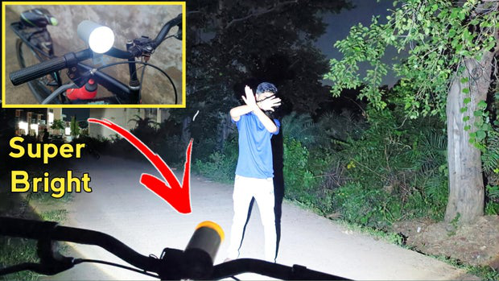{width="7.477777777777778in"
height="4.206944444444445in"}

> **Step 1: Get Your PCB Ready!**

**Talking about electronics.**

> After making the circuit diagram I transformed it into a PCB design to
> produce it, to produce the PCB, I have chosen the best PCB supplier
> and the cheapest PCB provider to order my circuit. with thereliable
> platform, all I need to do is some simple steps which we will talk
> later.
>
> Related Download Files

DIY Cycle Head Lamp: Page 1

{width="0.1388888888888889in"
height="0.1388888888888889in"}

> **As you can see in the pictures above the PCB is very well
> manufactured and I've got the same PCB assembled with all the
> components that we want to use for our main board and all the labels
> and logos are there to guide me during the soldering steps. You can
> also download the Gerber �le for this circuit from the download link
> below in case you want to place an order for the same circuit
> design.**

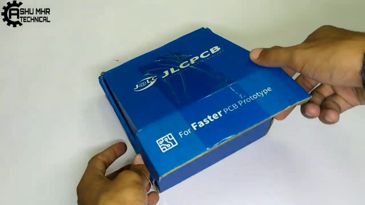{width="7.477777777777778in"
height="4.208333333333333in"}

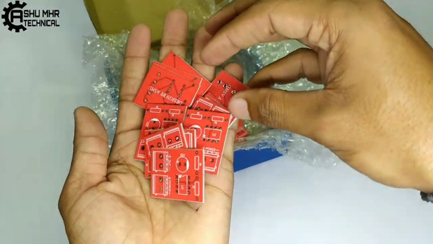{width="7.477777777777778in"
height="4.206943350831146in"}

DIY Cycle Head Lamp: Page 2

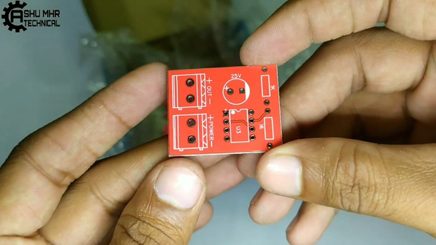{width="7.477777777777778in"
height="4.208333333333333in"}

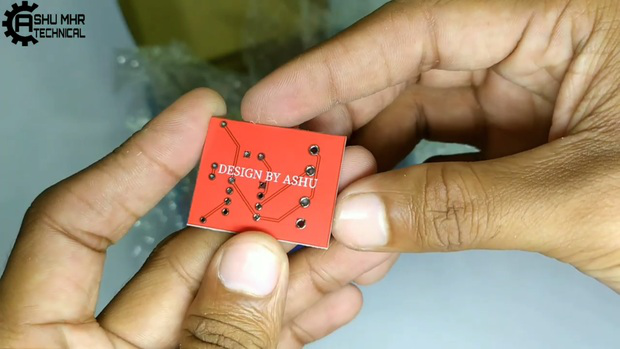{width="7.477777777777778in"
height="4.208333333333333in"}

**Step 2: Place All the Components and Solder It Properly.**

> Soldering the components.
>
> Refer to circuit diagram for connections.

DIY Cycle Head Lamp: Page 3

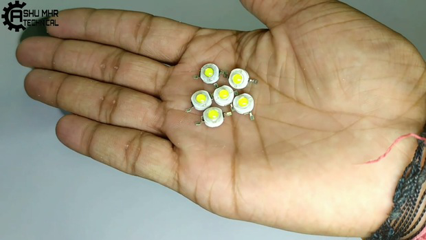{width="7.477777777777778in"
height="4.208333333333333in"}

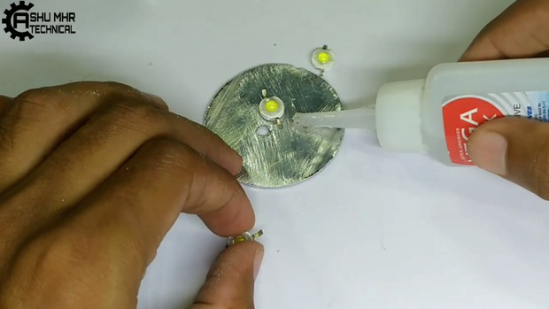{width="7.477777777777778in"
height="4.206943350831146in"}

DIY Cycle Head Lamp: Page 4

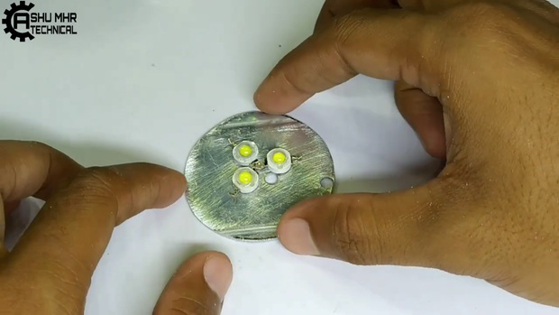{width="7.477777777777778in"
height="4.208333333333333in"}

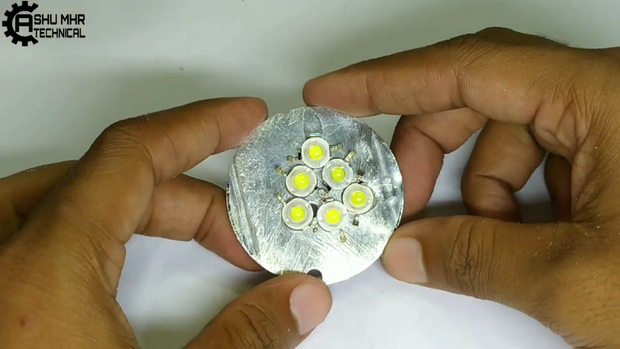{width="7.477777777777778in"
height="4.208333333333333in"}

DIY Cycle Head Lamp: Page 5

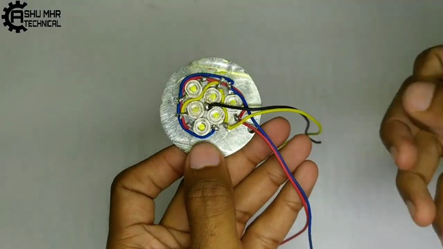{width="7.477777777777778in"
height="4.208333333333333in"}

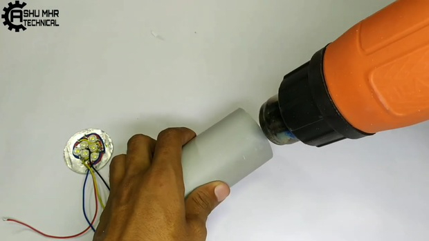{width="7.477777777777778in"
height="4.208333333333333in"}

DIY Cycle Head Lamp: Page 6

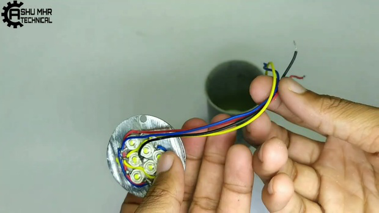{width="7.477777777777778in"
height="4.208333333333333in"}

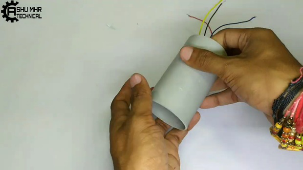{width="7.477777777777778in"
height="4.208333333333333in"}

DIY Cycle Head Lamp: Page 7

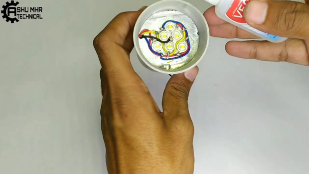{width="7.477777777777778in"
height="4.208333333333333in"}

**Step 3: Soldering All PCB Components.**

> {width="0.1388888888888889in"
> height="0.1527777777777778in"}Place all the through hole component and
> solder it to PCB.

DIY Cycle Head Lamp: Page 8

{width="7.477777777777778in"
height="4.208333333333333in"}

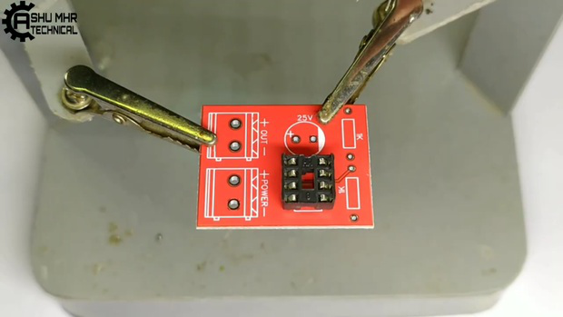{width="7.477777777777778in"
height="4.208333333333333in"}

DIY Cycle Head Lamp: Page 9

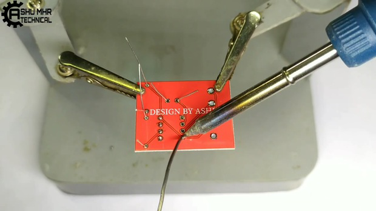{width="7.477777777777778in"
height="4.208333333333333in"}

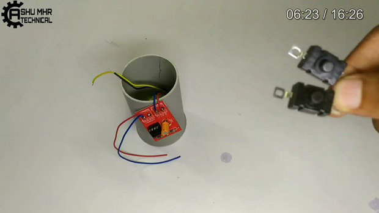{width="7.477777777777778in"
height="4.208333333333333in"}

**Step 4: Connection of Switches and Battery.**

{width="0.1388888888888889in"
height="0.1388888888888889in"}

> Make two holes in the circular PVC plate for the Push switches.
>
> Place the Push switches on the circular PVC plate and stick it with
> superglue. Make another hole for charging port in the same circular
> PVC plate.

DIY Cycle Head Lamp: Page 10

{width="0.1388888888888889in"
height="0.1388888888888889in"}

> Connect all the remaining connection and solder it as shown (Refer to
> circuit diagram). Warning: **Be Careful about polarity.**

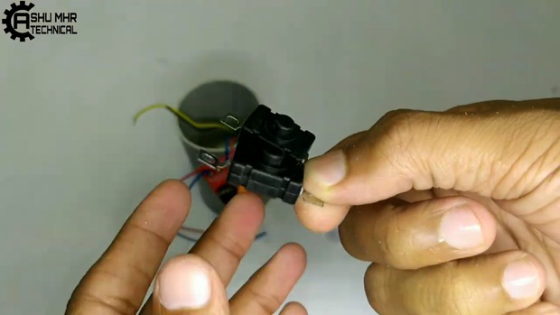{width="7.477777777777778in"
height="4.208333333333333in"}

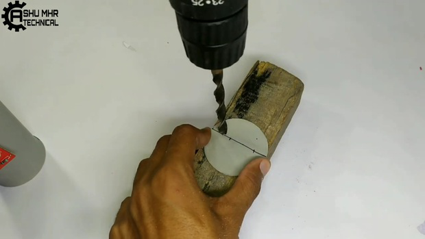{width="7.477777777777778in"
height="4.208333333333333in"}

DIY Cycle Head Lamp: Page 11

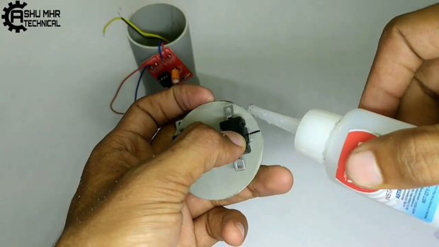{width="7.477777777777778in"
height="4.208333333333333in"}

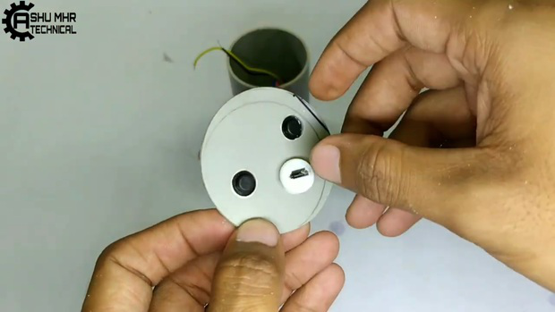{width="7.477777777777778in"
height="4.208333333333333in"}

DIY Cycle Head Lamp: Page 12

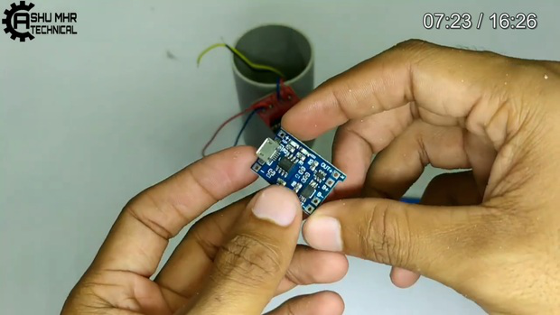{width="7.477777777777778in"
height="4.208333333333333in"}

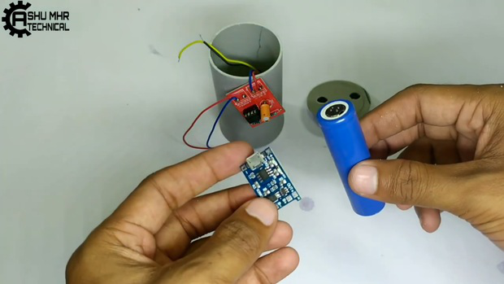{width="7.477777777777778in"
height="4.208333333333333in"}

DIY Cycle Head Lamp: Page 13

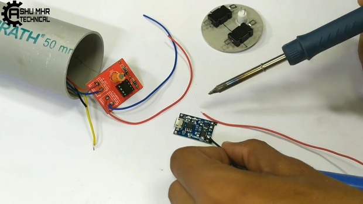{width="7.477777777777778in"
height="4.208333333333333in"}

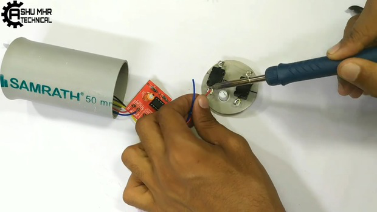{width="7.477777777777778in"
height="4.208333333333333in"}

DIY Cycle Head Lamp: Page 14

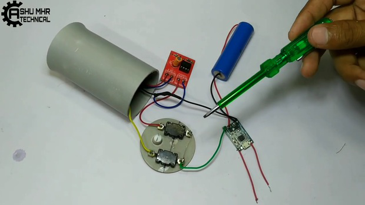{width="7.477777777777778in"
height="4.208333333333333in"}

**Step 5: Enclosing the Body.**

> {width="0.1388888888888889in"
> height="0.1527777777777778in"}Then stick all the remaining joints of
> PVC body with super glue.

DIY Cycle Head Lamp: Page 15

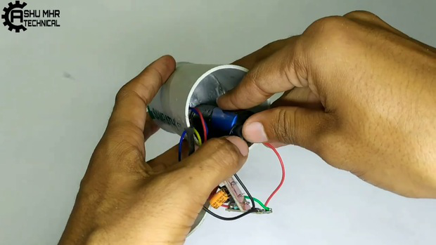{width="7.477777777777778in"
height="4.208333333333333in"}

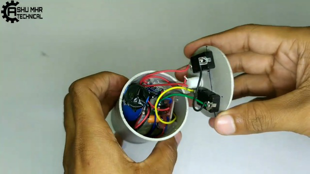{width="7.477777777777778in"
height="4.208333333333333in"}

DIY Cycle Head Lamp: Page 16

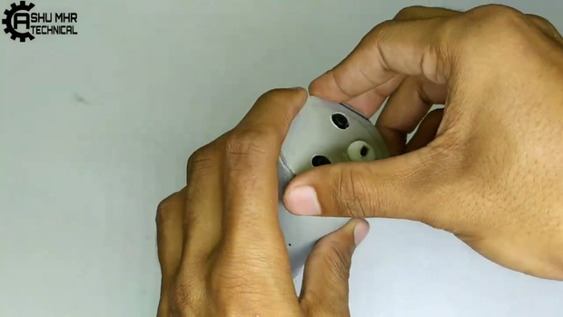{width="7.477777777777778in"
height="4.208333333333333in"}

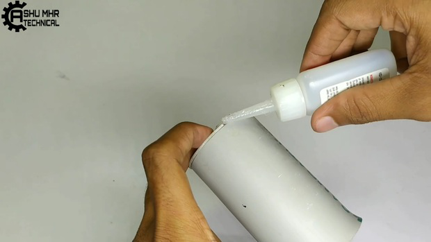{width="7.477777777777778in"
height="4.208333333333333in"}

DIY Cycle Head Lamp: Page 17

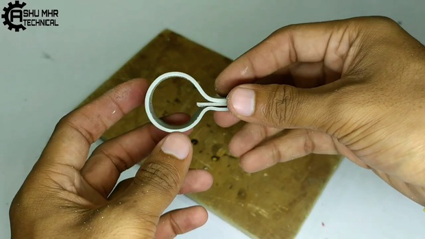{width="7.477777777777778in"
height="4.208333333333333in"}

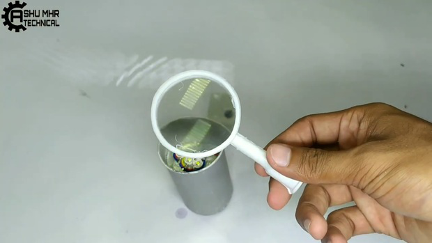{width="7.477777777777778in"
height="4.208333333333333in"}

DIY Cycle Head Lamp: Page 18

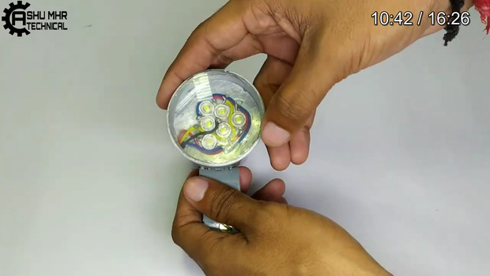{width="7.477777777777778in"
height="4.208333333333333in"}

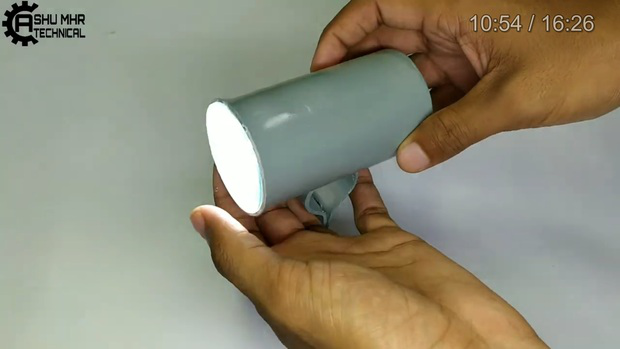{width="7.477777777777778in"
height="4.208333333333333in"}

DIY Cycle Head Lamp: Page 19

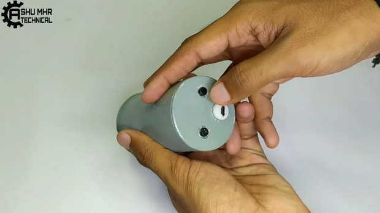{width="7.477777777777778in"
height="4.208333333333333in"}

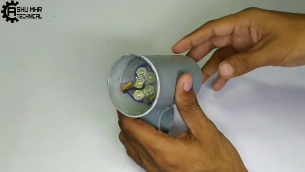{width="7.477777777777778in"
height="4.208333333333333in"}

DIY Cycle Head Lamp: Page 20

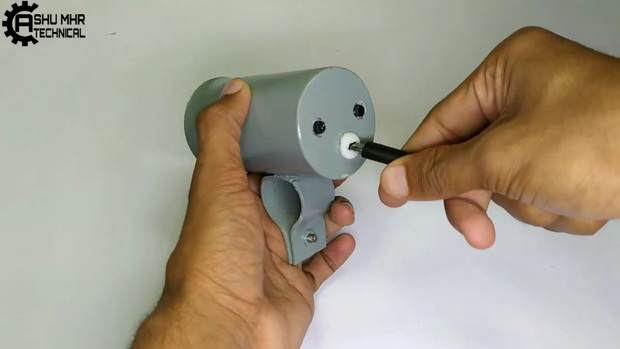{width="7.477777777777778in"
height="4.208333333333333in"}

> **Step 6: Testing**
>
> Finally, testing the **DIY Bicycle Lamp**
>
> Place/�x it in your bicycle handlebar and done!
>
> Your **DIY Bicycle Lamp DIY Bicycle Lamp** is now ready to lightup the
> path in darkness.

**New users will also get some coupons while registering atvia this blue
link.**

**Thank you for reading this guide, hopefully**, **this guide provides
full steps to help you to create your own this guide provides full steps
to help you to create your ownDIY**

**Bicycle Lamp.If you have any questions please post them in the comment
section below. If you have any questions please post them in the comment
section below.**

DIY Cycle Head Lamp: Page 21

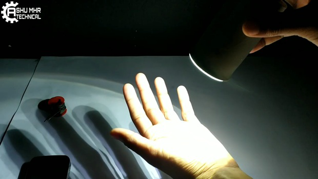{width="7.477777777777778in"
height="4.208333333333333in"}

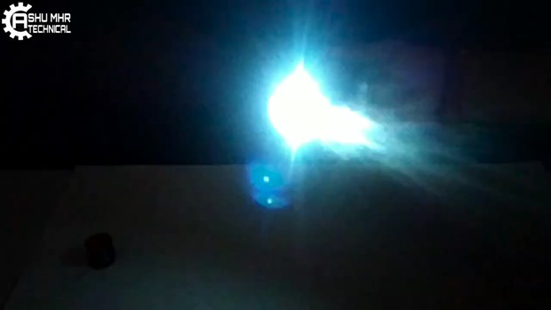{width="7.477777777777778in"
height="4.208333333333333in"}

DIY Cycle Head Lamp: Page 22

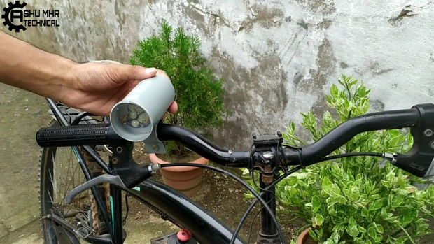{width="7.477777777777778in"
height="4.208333333333333in"}

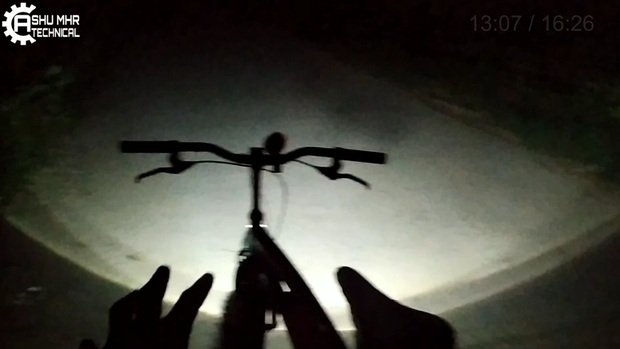{width="7.477777777777778in"
height="4.208333333333333in"}

DIY Cycle Head Lamp: Page 23

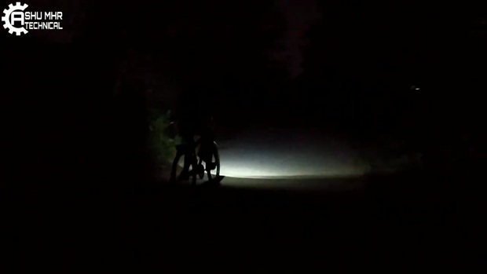{width="7.477777777777778in"
height="4.208333333333333in"}

DIY Cycle Head Lamp: Page 24
