# DIY-Bicycle-Light

> If you like cycling at night or any other time that\'s dark, this
> video will teach you how to make your own bicycle headlight. If
> you\'re trying to go for a night time bike ride but can\'t because
> it\'s too dark and dangerous, then don\'t worry because this DIY
> project is for you! With the steps in this tutorial, you\'ll be able
> to safely ride your bike all night long.
>
> **Supplies:**
>
> Get all the components ready.

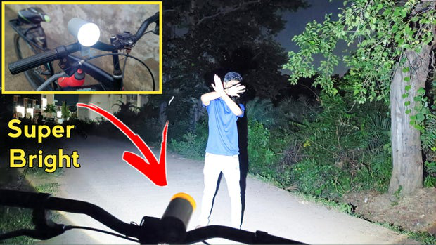

> **Step 1: Get Your PCB Ready!**

**Talking about electronics.**

> After making the circuit diagram I transformed it into a PCB design to
> produce it, to produce the PCB, I have chosen the best PCB supplier
> and the cheapest PCB provider to order my circuit. with thereliable
> platform, all I need to do is some simple steps which we will talk
> later.
>
> Related Download Files

> **As you can see in the pictures above the PCB is very well
> manufactured and I've got the same PCB assembled with all the
> components that we want to use for our main board and all the labels
> and logos are there to guide me during the soldering steps. You can
> also download the Gerber  le for this circuit from the download link
> below in case you want to place an order for the same circuit
> design.**

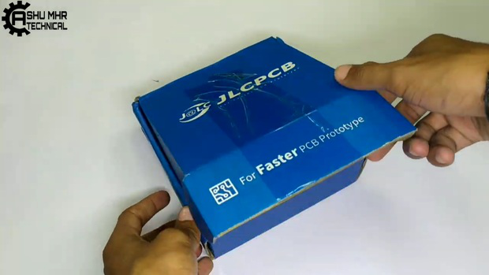
  

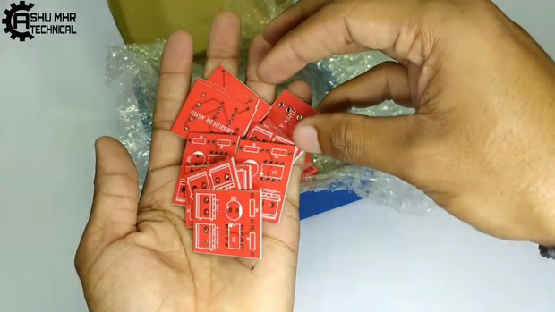
   

  

  

**Step 2: Place All the Components and Solder It Properly.**

> Soldering the components.
>
> Refer to circuit diagram for connections.

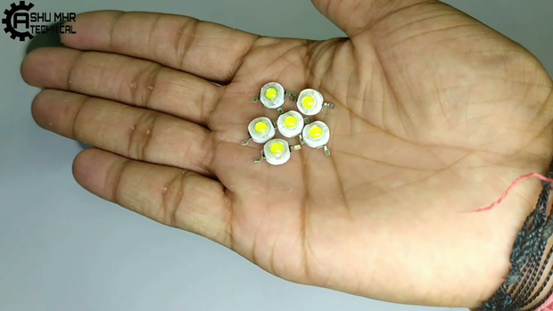
  

   

  

  

  

  

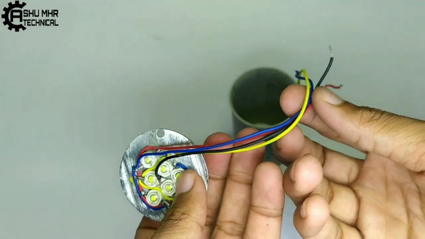
  

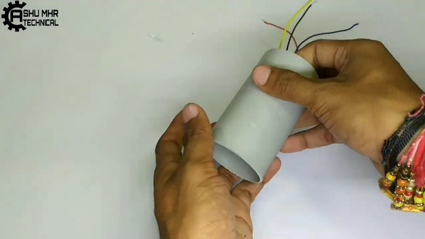
  

  

**Step 3: Soldering All PCB Components.**

>Place all the through hole component and
> solder it to PCB.

  

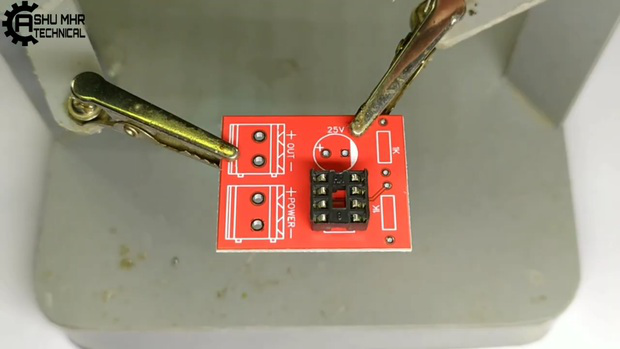
  

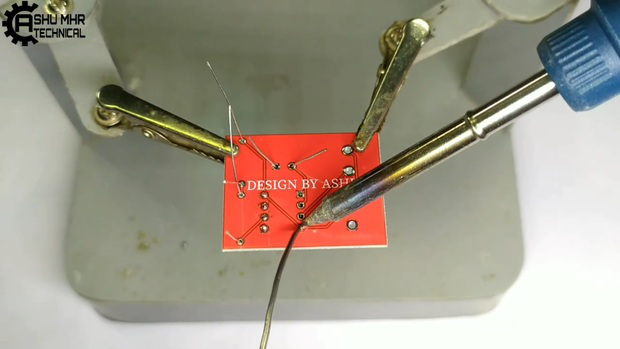
  

  

**Step 4: Connection of Switches and Battery.**

> Make two holes in the circular PVC plate for the Push switches.
>
> Place the Push switches on the circular PVC plate and stick it with
> superglue. Make another hole for charging port in the same circular
> PVC plate.

> Connect all the remaining connection and solder it as shown (Refer to
> circuit diagram). Warning: **Be Careful about polarity.**

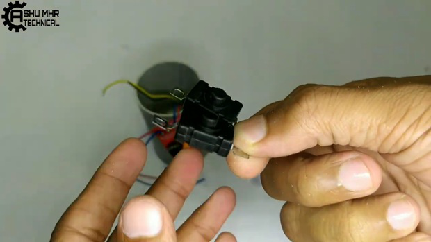
  

  

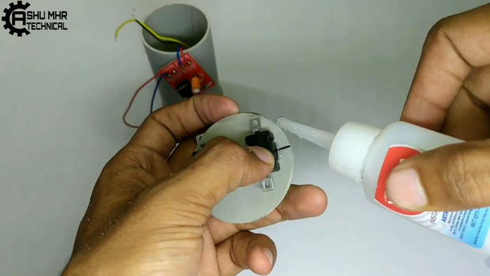
  

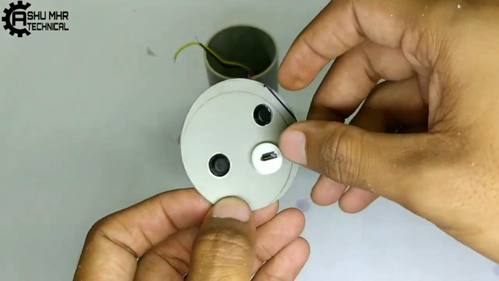
  

  

  

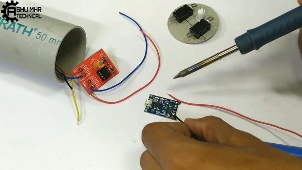
  

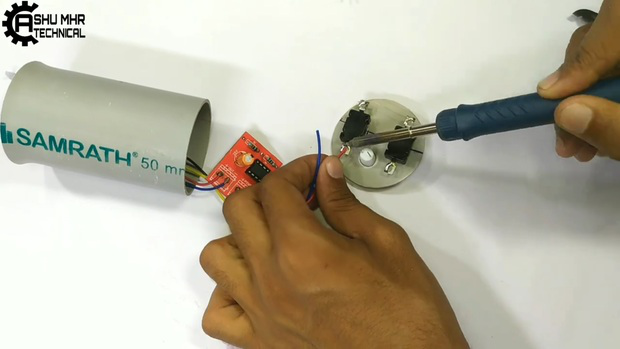
  

  

**Step 5: Enclosing the Body.**

>Then stick all the remaining joints of PVC body with super glue.

     
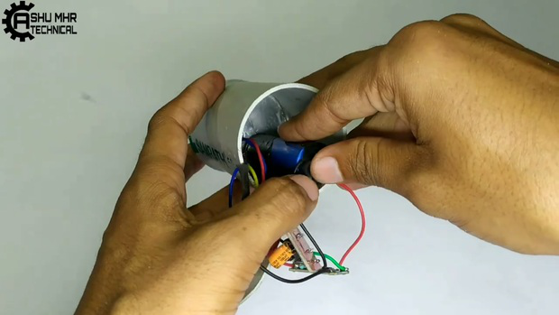
  

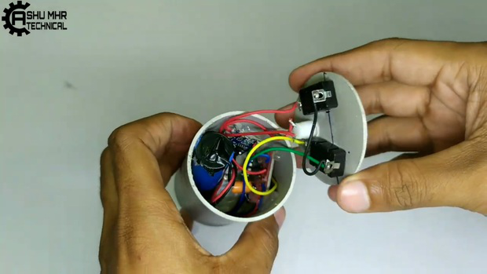
  

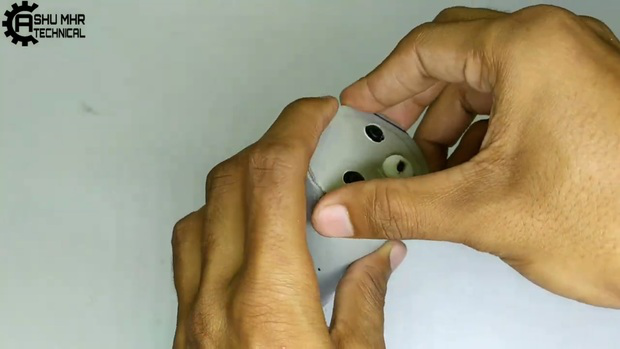
  

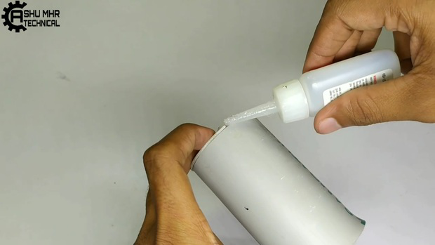
  

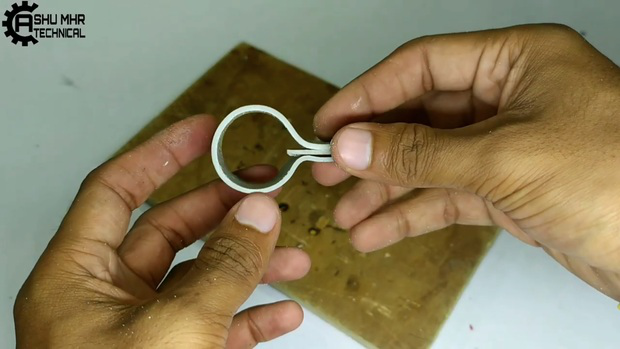
  

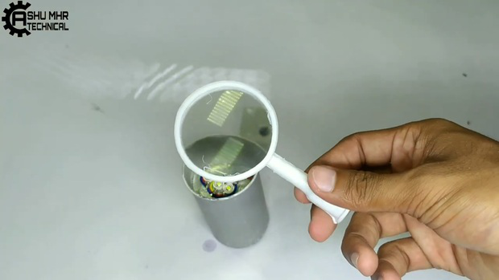
  

  

  

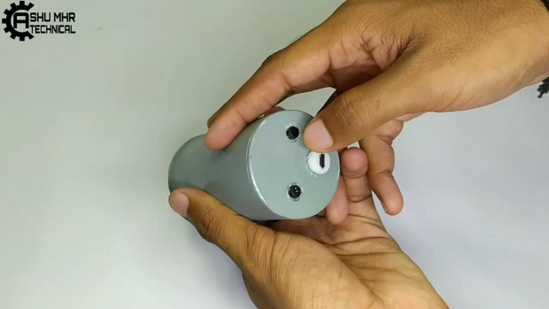
  

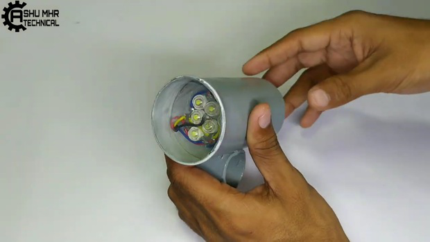
 

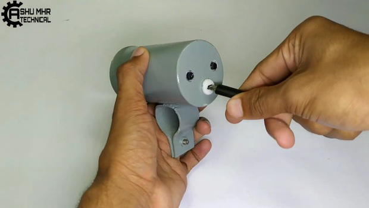
  

> **Step 6: Testing**
>
> Finally, testing the **DIY Bicycle Lamp**
>
> Place/fix it in your bicycle handlebar and done!
>
> Your **DIY Bicycle Lamp DIY Bicycle Lamp** is now ready to lightup the
> path in darkness.

**New users will also get some coupons while registering at [JLCPCB](https://jlcpcb.com/IAT) via this blue link..**

**Thank you for reading this guide, hopefully**, **this guide provides
full steps to help you to create your own this guide provides full steps
to help you to create your own DIY Bicycle Lamp.If you have any questions please post them in the comment
section below.**

     

  

  

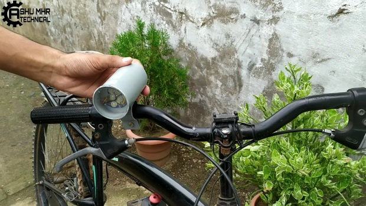
  

  

